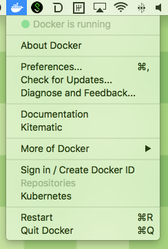
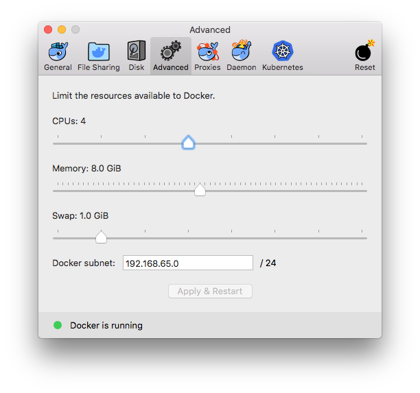

# Spark Workshop 

This workshop will teach you some basic Spark operations that can be used to do simple outlier detection. The example dataset we will use is the Amazon Electronics review (http://jmcauley.ucsd.edu/data/amazon/).

## Installation instructions (~15 minutes)
To make things smoother and avoid installation woes, I created a Docker container that will have all we need for this workshop pre-installed and separate from your system. 

Please follow the instructions below to start up the container:

1. If you don't have a Docker ID account yet, go to [Docker Hub](https://hub.docker.com/) and create an account.

2. Install Docker. On Mac OS X, you can download [Docker for Mac](https://store.docker.com/editions/community/docker-ce-desktop-mac) for an easy-to-install desktop app. 

3. Open Docker and enter your Docker Hub credentials.

4. Click on the Docker app icon and select "Preferences...". Under "Advanced", increase the memory available to containers to 8.0 GB.




5. Clone this repository using `git clone`:

```
$ git clone https://github.com/stefano-meschiari/spark_workshop.git
```

6. Open a terminal, navigate to the `spark_workshop` directory, and run: 
```
$ sh run.sh
``` 
from a terminal to download a JSON dataset and start the Docker container. 

7. You should be able to navigate to **`http://0.0.0.0:8889`** with your browser and see a Jupyter notebook instance. **The password is `spark`.**

8. You can exit the Docker session using `Ctrl+C`.

## Troubleshooting
If step 6 fails with error `unauthorized: incorrect username or password.`, run 

```
$ docker login
```

and enter your DockerHub credentials (username and password; username is _not_ your email).
